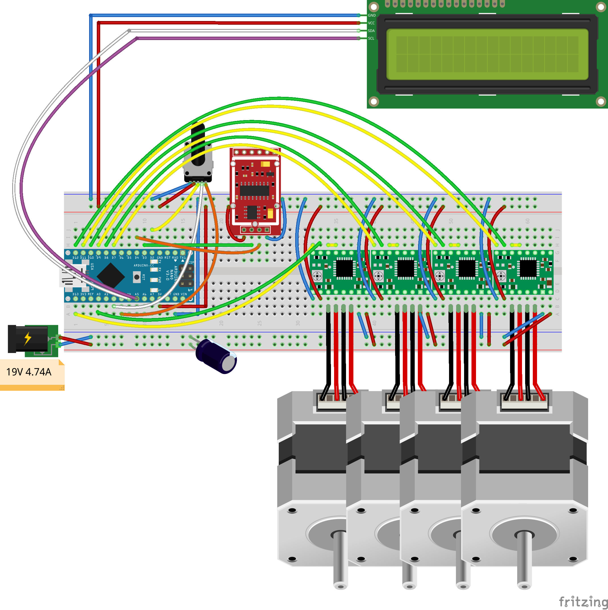

# BotTender

BotTender è un cocktail maker fatto con arduino che attraverso delle pompe peristaltiche create con dei motori passo-passo nema 17 ti permette di scegliere un drink da una lista predefinita. 

La quantità versata viene scelta dall'utente in base a quanti ml di liquido vuole nel suo bicchiere, e il cocktail viene servito rispettando le proporzioni della ricetta.

## Materiale utilizzato
- Arduino nano
- Alimentatore 19V 4.7A
- 4x Stepper Motor nema 17 1.5A 
- 4x Modulo A4988 driver per moter passo-passo
- Condensatore 50V 100μF 
- Rotatory encoder
- Display LCD 16x2 con interfaccia I2C
- Sensore di distanza ad ultrasuoni
- Sensore di carico digitale per cella di carico con modulo HX711 ADC 

## Librerie utilizzate
- [LiquidCrystal_I2C](https://gitlab.com/tandembyte/LCD_I2C)
- [TaskScheduler](https://github.com/arkhipenko/TaskScheduler)
- [EEPROM](https://www.arduino.cc/en/Reference/EEPROM)
- [HX711_ADC](https://github.com/olkal/HX711_ADC)
- [Wire](https://www.arduino.cc/en/reference/wire)
- [Statistics](https://github.com/provideyourown/statistics)

## Circuito

This work is licensed under a [Creative Commons Attribution 4.0 International
License][cc-by]. [![CC BY 4.0][cc-by-shield]][cc-by]

[![CC BY 4.0][cc-by-image]][cc-by]

[cc-by]: http://creativecommons.org/licenses/by/4.0/
[cc-by-image]: https://i.creativecommons.org/l/by/4.0/88x31.png
[cc-by-shield]: https://img.shields.io/badge/License-CC%20BY%204.0-lightgrey.svg